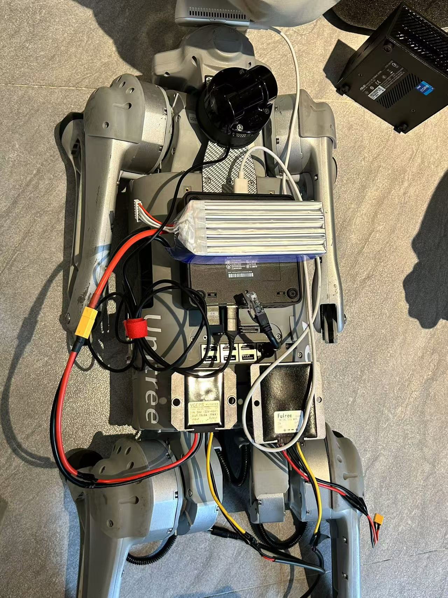
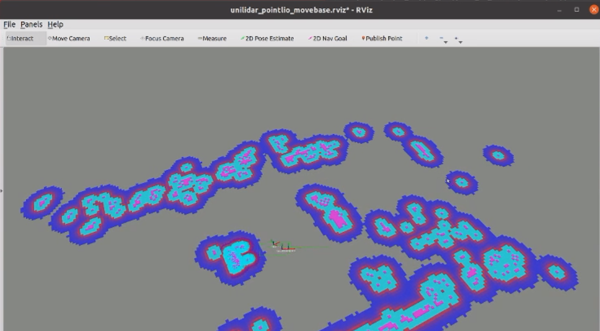

# Introduction

A simple example to make Go1 able to navigation using lidar L1 as sensor

### ros package in the workspace

- **go1_navigation**: ros params and launch file for move_base
- **point_lio_unilidar**: L1 lidar adapts with pointlio for 3d mapping
- **unitree_lidar_ros**: lidar sdk for ros
- **unitree_ros_to_real**: GO1 control sdk for ros

### Reference

GO1 ros sdk: https://github.com/unitreerobotics/unitree_ros_to_real

L1 lidar adapts with pointlio: https://github.com/unitreerobotics/point_lio_unilidar

`Point-LIO` is a robust and high-bandwidth lidar inertial odometry (LIO) with the capability to provide accurate, high-frequency odometry and reliable mapping under severe vibrations and aggressive motions. If you need further information about the `Point-LIO` algorithm, you can refer to their official website and paper:

- https://github.com/hku-mars/Point-LIO
- [Point‐LIO: Robust High‐Bandwidth Light Detection and Ranging Inertial Odometry](https://onlinelibrary.wiley.com/doi/epdf/10.1002/aisy.202200459)

# Environment

This package was tested in Ubuntu 20.04 and ROS noetic environment


<div align="center">
    <div align="center">
        
    </div>
    <font>GO1 with L1 lidar</font>
</div>

# Build

clone this repositories as  a ros catkin workspace

```
git clone https://github.com/DedSecer/go1_navigation
```

update submodule
```
cd go1_navigation
git submodule update --init --recursive
```

install depences 

*Make sure you have rosdep installed and initialize. If you're having network issues, try to use [rosdepc](https://zhuanlan.zhihu.com/p/398754989).*

```
rosdep install --from-paths src --ignore-src -r -y 
```
compile
```
catkin_make
```

# Run
```
source devel/setup.bash
roslaunch point_lio_unilidar mapping_move_base.launch
```

It will open a rviz visualization window that you can send navigation goal




or start by a forward and back demo

```
source devel/setup.bash
roslaunch point_lio_unilidar forward_and_back.launch
```

it will let GO1 walk a distance and back to the start

you can change the distance by modify the rosparam in the launch file(default: 1)